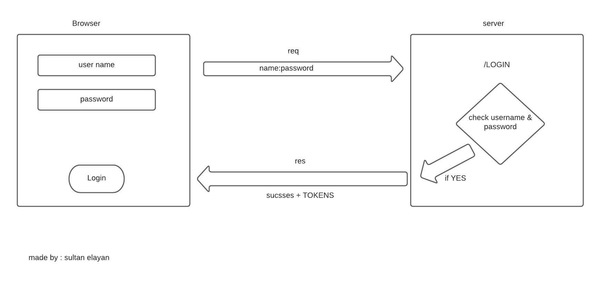

# basic-auth

## NOTES

1. authentication vs authorization 
2. make sing in and sign up system

## Provided Link

- repo action -->> [repo action](https://github.com/sultan-elayan/basic-auth/actions)
- PR -->> 
- heroku deployment -->> 

## MUL

